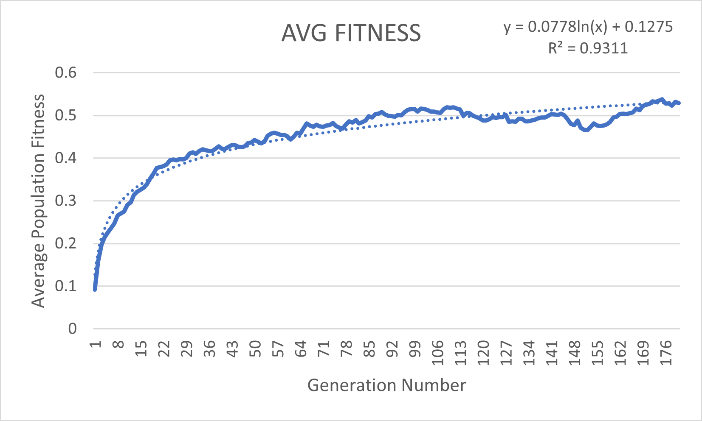

# Natural Selection Genetic Algorithm
Simulating Natural Selection

## Purpose
The purpose of this project was to start learning about machine learning through different algorithm types, as well as brush up on Java graphics. The idea is to simulate nature's process of evolution.

## Description
Each dot represents an Organism. They are all generated at the same initial location, a pink dot towards the bottom of the screen. At first, their movements are completely random. Each Organism has a Gene object that holds 100 movements, and each gene is applied sequentially and shown on screen. After all the movements have been applied, each Organism is given a score from 0 to 1 representing how close it is to the goal. This is its fitness. Depending on their fitness score, an Organism is more likely to be selected to be a parent for the next Generation, thus increasing the likelihood that the next Generation goes farther than the previous. I should note that an Organism has a chance that it's genes are mutated, as occurance with real life. This process repeats, each generation gets more and more fit, until it plateaus. This is Natural Selection in action.

## Genetic Algorithm Implementation
The Natural Selection Algorithm is split into 3 parts:
1. [Selection](#selection)
2. [Crossing Over](#crossing-over)
3. [Mutation](#mutation)

### Selection
The higher the Organism's fitness, the more it is represented in a mating pool. After the mating pool is constructed, N * 2 organisms are chosen, where N is the number of Organisms in a population. This stays constant throughout each generation. So, a mother and a father is chosen. Next is to cross over.

### Crossing Over
Different Crossing Over patterns can be used. The method implemented in the algorithm is a 
> M D M D M D . . .
pattern, however any pattern can be used as long as the genes are being interchanged.
So at this point.

### Mutation
After the genes are crossed over, what's left is to mutate them! For each child, we loop through it's genes. Again, this is the array of movements that have been inherited and crossed over from the two randomly selected parents. 2% of the time, a gene will be mutated. This value can change, but for consistency the program runs the simulation at 2%. After some of the genes have been mutated, the child is passed on to the next generation, where the process starts again.

## Results
With each generation, the population was moving closer and closer to the dot. Depending on factors like the population size, movement multiplier, and number of genes, the populations would only achieve a certain average fitness. Usually this was between 0.5 and 0.75. The program recorded this data to an Excel file, and I created this graph of a population's evolution.

As you can see, the change in a population's average fitness has a logarithmic definition; it rises rapidly, then reaches a cutoff point. I thought it was really interesting that, despite the lack of any other outside factors, the population growth still capped. With each generation, the organisms gravitated towards the mean. With this, the dots' behaviors are normalizing, and the trans-generational difference in fitness is minimizing.